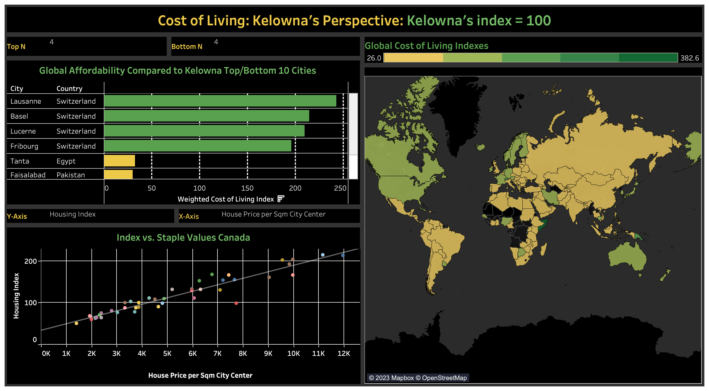
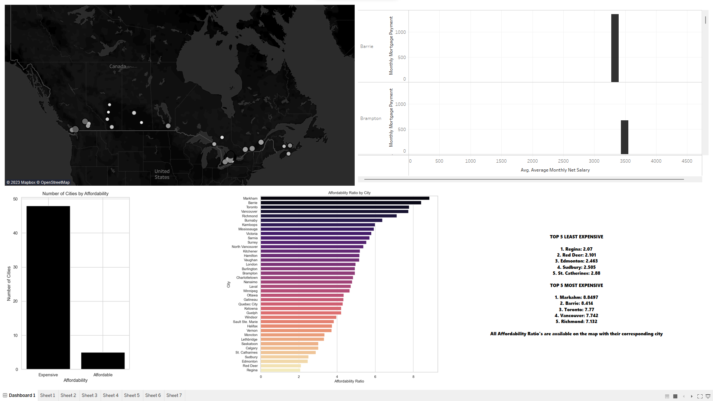

# Group 16 - The Expensive Reality: an Analysis of the Global Cost of Living

## Our Topic and Interests

Our group will be examining the economic topic of the cost of living. With our analysis, we wish to understand the current cost to live locally in Kelowna and around the world. Moreover, due to current record-high inflation levels affecting households and individuals more than ever, we hope to examine both the necessities and luxuries of living and establish connections and relationships to find out where consumers are feeling the sting the most. That being said, we think this is an important topic to discuss as both individuals and firms can benefit by planning their finances accordingly which will lead to fewer surprises when it comes time to pay for goods and services. 

  

In terms of specific questions, we would like to know just how affordable it is to live in Kelowna, British Columbia, Canada compared to other cities from around the world, by examining necessities such as food shelter and transportation. We also wish to analyze the cost of luxuries and determine if there are any countries where some items cost significantly more for any reasons such as potential tariffs or trade-related reasons. Overall, we aim to provide a competent analysis of the global cost of living. 

## Our Dataset

[The Global Cost of Living dataset](https://www.kaggle.com/datasets/mvieira101/global-cost-of-living) was retrieved from Kaggle and originally sourced from Numbeo, a Serbian crowd-sourced global database of various statistics including consumer prices. This particular dataset includes the cost of living data on well over 4500 cities across the world.

The purpose of this dataset is to provide the public with crowd-sourced data to estimate the cost of living in different cities around the world. With over 50 variables that range from the cost of a McDonald's meal to a pair of Levi's jeans, this dataset can serve both individuals and select businesses that wish to compare the relative affordability of a specific location.

The data was gathered by scraping Numbeo's website and according to the description on Kaggle, it includes updated values as of December 3rd, 2022. Although the data is crowd-sourced, it still includes valuable information that serves as a rough estimate of the cost of living across various locations.

Altogether, this dataset from Numbeo's crowd-sourced website brings over 50 variables of consumer goods, services and other metrics such as personal monthly income from over 4500 cities worldwide. This dataset is certain to provide valuable insight into what makes it: an expensive reality.

### Sub Dataset
The [Canada Cities Database](https://simplemaps.com/data/canada-cities) offers over 7,986 cities and towns from all provinces and territories in Canada. It was built from the ground up by **simple maps** using authoritative sources such as Statistics Canada. 

## Team Members

- [**Robert Yacovelli**](https://github.com/ubco-W2022T2-data301/project-group16/blob/main/analysis/analysis_yacovelli.ipynb): I am a second-year DATA Major. I am interested in Economic topics and I enjoy learning new ways to communicate through numbers and eye-catching, informative visuals.

- [**Oliver Medgyesi**](https://github.com/ubco-W2022T2-data301/project-group16/blob/main/analysis/analysis_medgyesi.ipynb): I am a second-year Computer Science Major. I'm a dedicated and analytical individual with an interest in mathematics and programming. I try to continuously expand my knowledge and I enjoy learning new things.

- [**Kenta Selim Ishdia**](https://github.com/ubco-W2022T2-data301/project-group16/blob/main/analysis/analysis_yacovelli.ipynb): I am a third year exchange student from a university in Japan. I'm studying data science there. I like both math and programming, but recently I started statistics and really have fun learning it.

## Tableau Dashboard Images

## References

>[Global Cost of Living Dataset - Kaggle](https://www.kaggle.com/datasets/mvieira101/global-cost-of-living)

>[Canada Cities Database - simple maps](https://simplemaps.com/data/canada-cities)

>[Calculator Potato photo](https://pixabay.com/photos/coins-calculator-budget-1015125/)

