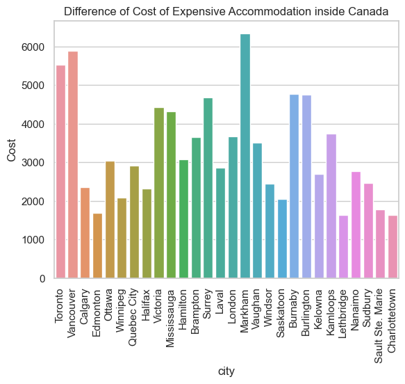
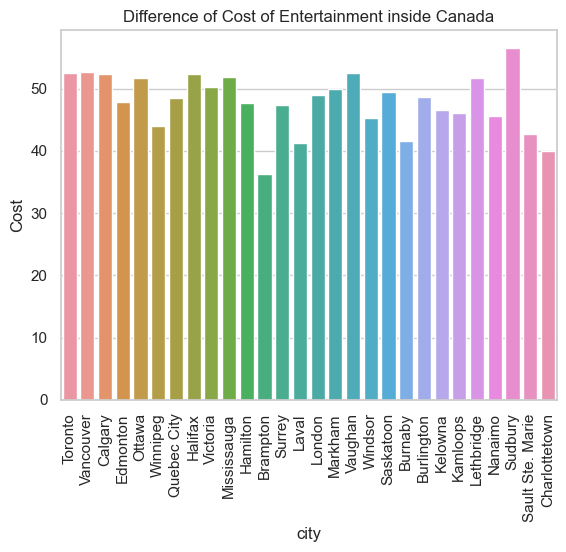
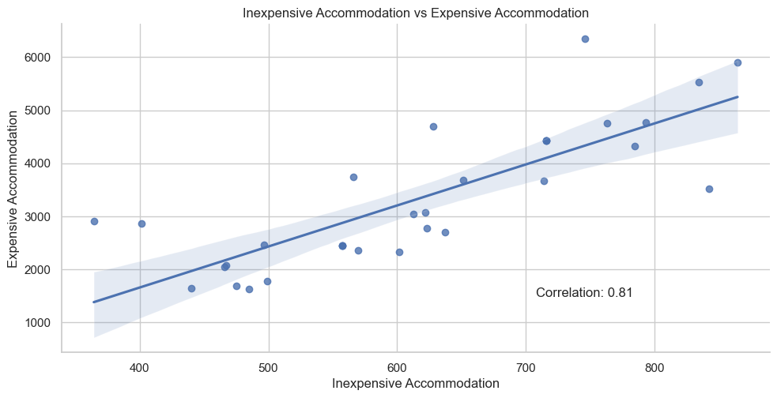
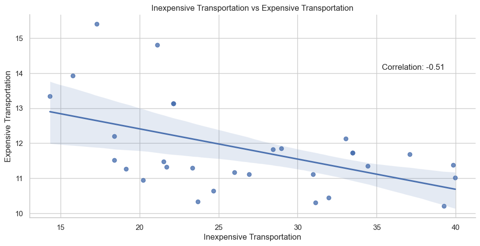

# Final Report - Group 16
## **Introduction**
Our group examined the global cost of living. Within our analysis, we wished to understand the current cost to live locally in Kelowna and around the world. Due to record high inflation in 2022/23 seen throughout the world, our group was interested in seeing if we could find out where it is considered unaffordable to live and what categories influence affordability the most. Moreover, our group was interested in necessities such as food, housing and transportation costs alongside luxuries such as restaurants and accommodation. Altogether we wish to examine how the cost of living varies city-to-city/country-to-country, where the cost of living is lower/higher and finally why this is the case.

## **Exploratory Data Analysis**
Here is a summary of the highlights of our group's EDAs:

- In **Robert's** exploratory data analysis he started by analysing the missing data in the data set and visualized where in the world the good quality data exists along with a correlation heatmap and did some basic scatter plots with some linear regression.

- For **Oliver's** analysis he used barplots to compare multiple cities and their affordability ratios and percentage salaries. Using these plots, he was able to determine which cities were considered affordable, moderate, and expensive in Canada.

- In **Ken's** analysis he utilized...TODO

## Research Question 1: and Results: *How livable is it in Kelowna compared to other cities globally?*

### Analysis done by **Robert Yacovelli** [here.](https://github.com/ubco-W2022T2-data301/project-group16/blob/main/analysis/analysis_yacovelli.ipynb)
In **Robert's** analysis he used a variety of plots although primarily relying on facet grids to show multiple histograms based on the cost of living indexes and scatter plots to determine where cities rank in terms of affordability. This made it clear to see the distribution of cities ranked according to their indexes.

### **1.1:**  *How does the cost of necessities, such as food items, transportation, and shelter vary across different cities as compared to Kelowna, serving as the baseline?*

To answer this question I first took all the relevant columns related to food, housing and transportation. I set Kelowna to be the baseline city with an index level set to 100. Any city above or below 100 represents a % change in affordability in that category. 

Here I found that Kelowna is generally more expensive in food and housing while appearing to be cheaper in the transportation category. These visuals also provide a good look at the distribution of the indexes by city. 

Answering the research question it is clear that after plotting the weighted cost of living Kelowna is on the right side of the distribution indicating it is generally more expensive to live in Kelowna as compared to the other cities included in the dataset. 

### **1.2:** *Can the price of a McDonald's meal tell us anything about the cost of living in a country?*

Serving as a secondary question I wanted to investigate any possible correlation between the price of a McDonald's meal and the affordability in a city and more specifically within a country.

According to this plot, the cost of a McDonald's meal does not accurately depict the overall affordability in a country since the Weighted Cost of Living Index by country has a correlation value of `0.47`. This is also the case for the Housing and transportation index with an even lower correlation of `0.27`. 

Where the cost of McDonald's meals may provide some estimation of affordability within a country is with the food index given there is a `0.74` correlation value. 

We can then answer this question by confirming that in this case, the price of a McDonald's meal is an okay indicator when it comes to the overall cost of food in a country. 

### **1.3:** *How do the prices of different types of transportation (public transit, taxi, personal car) vary across different countries and how does this variation relate to differences in income and cost of living?*

 The purpose of this question was to analyze whether or not when the ability to transport yourself (to your job) is cheaper and whether or not you earn more. To answer this question I took 5 richer and 5 developing countries and compared the cost of each type of transportation alongside the monthly salary for each country.

The main takeaway from this plot and the answer to this question was that cheaper transportation does not equate to a higher salary. Another plot was done in the [analysis](https://github.com/ubco-W2022T2-data301/project-group16/blob/main/analysis/analysis_yacovelli.ipynb) to verify that this was also the case for ALL countries in the dataset. 

### Summary RQ1: 
     - Kelowna is generally more expensive and a less affordable city to live in. 
     - The price of a McDonald's meal is an okay indicator when it comes to the overall cost of food in a country.
     - Cheaper transportation does not equate to a higher salary.

## Research Question 2 and Results:

 - ### Analysis done by **Oliver Medgyesi** [here](https://github.com/ubco-W2022T2-data301/project-group16/blob/main/analysis/analysis_medgyesi.ipynb)

### **2.1** *How does the affordability of housing in Canada vary relative to the average monthly net salary. Also, how does Kelowna compare in terms of housing prices compared to other cities in Canada?*

To answer this reasearch question, I created an affordability ratio column inside my dataset to indicate whether a city is considered to be expensive, moderate, or affordable. The classifications of these categories are mentioned inside of my analysis. Kelowna is considered to be rank 18/45 with an affordability ratio of 4.22. This classifies Kelowna as a moderately expensive location for real estate as it is less than 5.5 but greater than 3.0. 

---

---

### **2.2** *Overall, is it more affordable to live in the suburbs compared to inside of the city in Canada?*

By calculating the affordability ratio for 1BR and 3BR apartments inside and outside of the city, I was able to conclude that both 1BR and 3BR apartments inside the city are more affordable. 

---

Here are some conclusions I drew from this plot:

- In general, Poperty values tend to be more expensive in suburban areas comapred to the city.
- Apartments in the city tend to have less demand as there is a lack of space and can be irritabile at times.
- Living costs also tend to be more expensive inside the city as there are more ammenties and higher utility costs.

---

### **2.3** *What percentage of the average salary in Kelowna is required to afford the current housing prices and how has this changed overtime?*

The purpose of this question was to determine what percentage of the average salary for each city, specifically Kelowna, is required to afford the current housing prices. With this information, we are able to as conclude how much of the excess salary can go towards the extra costs of living such as food, water, electricity, etc. To do this I created a "percentage salary" column which determines how much of the average salary is required to pay a monthly mortgage over a 30 year term. Specifically for Kelowna, the percentage salary/average monthly salary totalled to 15%. This means that 15% of the overall salary must go towards mortgage payments. 

---

---
Unforuntately our dataset did not contain a year section so I was unable to determine changes overtime for any of my data.  Generally, we can see that most cities are affordable when we approach the market this way. But keep in mind that this is over a 30 year term which will drastically decrease the monthly payments.

### Summary RQ2: 
     - Kelowna housing is a moderately expensive location to live in Canada.
     - It is more affordable to live inside the city in Canada.
     - Over a 30 year term, most cities in Canada can offer an affordable mortgage payment (Less than 30% of your monthly salary towards payments).

## Research Question 3 and Result:   How the cost of other stuff, which are considered not necessary for living, different between cities in Canada?

### Analysis done by **Kenta Selim Ishida** [here](https://github.com/ubco-W2022T2-data301/project-group16/blob/main/analysis/analysis_ishida.ipynb)
These 3 following questions helps to answer RQ3, and to get deeper understanding for RQ3. 
### 3.1: If there are differences, is there any factors for the difference?
To answer this question, I will first show the bar plots of cost of items categorized by type in various Canadian cities.

These visualizations reveal that the costs are different between cities even they are both cities in Canada. Moreover, it is obvious that the disparties are big for some categories, but for some categories the disparties are neligible. We found that there are differences between cities, so we will now find the factors for the differences using heatmap.

The heatmap presented depicts the correlation between each pair of columns within the dataset. The visual representation effectively showcases the strength of correlations between various columns, with notable correlations observed between food and accommodation, food and population, accommodation and density, and entertainment and net salary. These findings suggest that there exist discernible factors contributing to cost discrepancies, and furthermore, that such factors may vary across distinct categories.

### 3.2: Do values of daily necessities affects the value of other stuff?

To answer this question,  I conducted a comparative analysis between each luxury item and its corresponding necessity within the same category. I have included plots of two remarkable findings that have emerged from my research in this section.

The plot above is a scatter plot of price of accommodations sorted into two categories of inexpensive expensive options with a linear trendline. Here I found the prices of inexpensive accommodations and expensive accommodations are in direct proportion.

The plot above is a scatter plot of price of transportation sorted into two categories of inexpensive expensive options with a linear trendline. I personally think this is the most interesting fact I have found in my entire research. Surprisingly, the prices of inexpensive transportation and expensive transportation are in inverse proportion.

### 3.3: Which luxuary shows the general cost of luxuaries the best?

To answer this question, I first plotted correlations between each categories and general cost of luxuaries.

The most bottom raw dispicts the correlations that I wanted. Obviously, price of food and accommodation have strong correlation to price of luxuaries in general. Especially, the price of accommodation has correlation of over 0.9, which can be cosidered as a indicator of the price of luxuaries in general. The scatter plot below illustrates the relationship between those two.

### Summary RQ3:
    - There are difference of costs of luxuaries between Canadian cities, and factors vary across categories.
    - For some categories the price of necessities to the same categories of luxuaries. However, the relations are not the same for all categories.
    - The price of expensive accommodations can be an indicator of the cost of luxuaries in general.

## Conclusion 

Our group has concluded that Kelowna is typically a more expensive city in comparison to other places in Canada. The price of food and transportation does not indicate the overall cost of living and cheaper transportation does not suggest a higher salary. We found that real estate in Kelowna tends to be moderately expensive, and that it is more afforadble to live inside the city in Canada. Finally, it was discovered that high-end resources can equate to the overall cost of luxury products.
